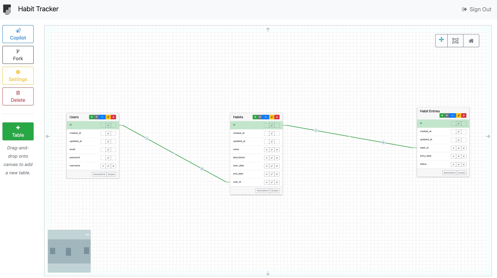

# HabitBuddy

HabitBuddy is a Ruby on Rails app for tracking and managing your daily habits.

## Instructions

To get HabitBuddy up and running locally, follow these instructions:

1. **Clone the repository:**

   ```bash
   git clone https://github.com/yourusername/HabitBuddy.git
   cd HabitBuddy

2. **Install dependencies:**

    ```bash
    bundle install

3. **Set up the database:**

    ```bash
    rails db:create
    rails db:migrate
    rake sample_data

4. **Start the rails server:**

    ```bash
    rails server

5. **Open your brower and go to '(http://localhost:3000)`**

## Configuration

No additional configuration is needed for running the app locally.

## Contribution Guidelines

### How to Contribute

1. **Setup your environment:** Follow the installation instructions above.
2. **Find an issue to work on:** In the Projects tab, check out our issues, at times I may have some issues labeled "good first issue".

### Coding Conventions
We adhere to the Ruby community style guide, and we expect all contributors to follow suit. Here are key conventions specific to our project:

* **Code Style:** Follow the <a href="https://rubystyle.guide/">Ruby Style Guide</a>, which provides detailed guidelines on the coding style preferred by the Ruby community.
  
* **Naming Conventions:**
  - Use ```snake_case``` for variables, methods, and file names.
  - Use ```PascalCase``` for class and module names.
  - Reflect domain concepts accurately in naming. For instance, if you are working within an event within a calendar, prefer names like usesr_event over vague terms like data_entry.

* **Design Principles:** Focus on Domain-Driven Design (DDD):
  - Organize code to reflect the domain model clearly.
  - Use service objects, decorators, and other design patterns that help isolate domain logic from application logic.

* **Testing Conventions:**
  - Write tests for all new features and bug fixes.
  - Use RSpec for testing, adhering to the <a href="https://rspec.rubystyle.guide/">RSpec Style Guide.</a>
  - Ensure test names clearly describe their purpose, reflecting domain-specific terminology.

### Comments and Documentation

* **Comment your code** where necessary to explain "why" something is done, not "what" is done—source code should be self-explanatory regarding the "what".
* **Document methods and classes** thoroughly, focusing on their roles within the domain model, especially for public APIs.

### Version Control Practices
* Commit messages should be clear and follow best practices, such as those outlined in<a href="https://cbea.ms/git-commit/"> How to Write a Git Commit Message.</a>
* Keep commits focused on a single issue to simplify future maintenance and troubleshooting.

### Branch Naming Conventions
Please use the following naming conventions for your branches:
* ```<issue#-description>``` (i.e 31-initials-added-ransack-search)

### Pull Request Process
1. **Creating a Pull Request:** Provide a detailed PR description, referencing the issue it addresses.
2. **Review Process:** PRs require review from at least one maintainer.

## ERD

The Entity Relationship Diagram (ERD) of HabitBuddy


## Troubleshooting

If you encounter issue, check the following: 

1. Common issues: Ensure you have run all migrations and ran the rake sample_data task.

## Visual Aids

[Watch the video](https://drive.google.com/file/d/1NT-ekYPlydL5cp9SQh5jFlhjeaqwovAg/view)

## API Documentation

HabitBuddy does not provide its own API endpoints. 

## Github Project

[Link to Github Project](https://github.com/users/reherr/projects/1)
[Link to Github Repository](https://github.com/reherr/habit-buddy)
